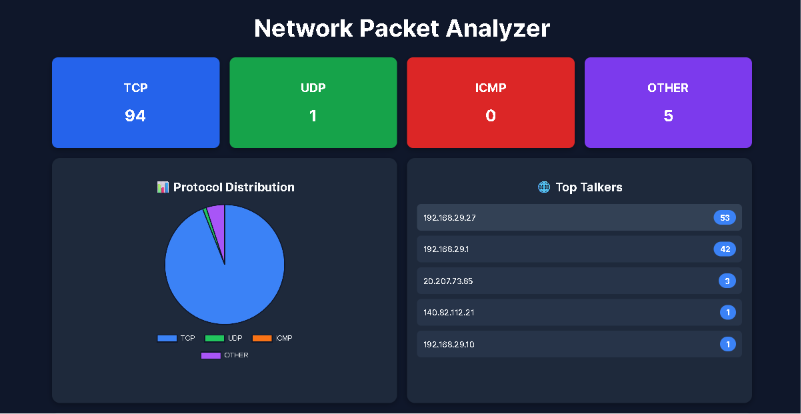
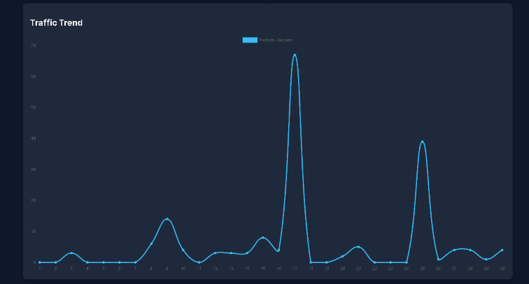
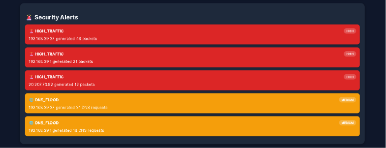
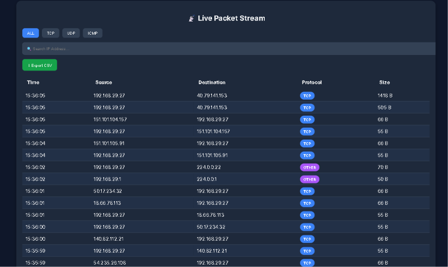

# Network Packet Analyzer Dashboard

A real-time network monitoring and security analytics dashboard built using FastAPI, React, Scapy, WebSockets, and Chart.js. The application captures live network packets, analyzes traffic patterns, detects suspicious activities, and visualizes network statistics through an interactive dashboard.

## Features

### Real-Time Packet Capture

* Captures live network traffic using Scapy
* Extracts source IP, destination IP, protocol, ports, and packet size
* Supports TCP, UDP, ICMP, and other protocols

### Live Dashboard

* Real-time protocol statistics
* Interactive protocol distribution chart
* Traffic trend visualization
* Top Talkers analysis
* Live packet stream table

### ## Dashboard Screenshots

### Main Dashboard



### Traffic Analytics



### Security Alerts



### Live Packet Monitoring


### Security Monitoring

* High Traffic Detection
* DNS Flood Detection
* Traffic Spike Alerts
* Severity-based alert system

### Analytics

* Protocol Distribution
* Network Traffic History
* Top Source IP Analysis
* Packet Rate Monitoring

### Data Export

* Export captured packet data to CSV
* Download network traffic reports

## Tech Stack

### Backend

* FastAPI
* Scapy
* WebSockets
* Python
* Pandas

### Frontend

* React.js
* Vite
* Chart.js
* React ChartJS 2
* Axios

## Project Structure

```text
backend/
│
├── app/
│   ├── api/
│   ├── packet_capture/
│   ├── services/
│   ├── websocket/
│   ├── main.py
│
├── requirements.txt

frontend/
│
├── src/
│   ├── components/
│   ├── services/
│   ├── App.jsx
│
├── package.json
```

## Installation

### Clone Repository

```bash
git clone https://github.com/mayankrajput5455/network-packet-analyzer-dashboard.git
cd network-packet-analyzer-dashboard
```

### Backend Setup

```bash
cd backend

python -m venv venv

venv\Scripts\activate

pip install -r requirements.txt

uvicorn app.main:app --reload
```

Backend runs on:

```text
http://127.0.0.1:8000
```

### Frontend Setup

```bash
cd frontend

npm install

npm run dev
```

Frontend runs on:

```text
http://localhost:5173
```

## API Endpoints

| Endpoint         | Description                  |
| ---------------- | ---------------------------- |
| /stats           | Protocol statistics          |
| /alerts          | Security alerts              |
| /traffic-history | Traffic trend data           |
| /top-talkers     | Top source IP addresses      |
| /export-csv      | Export packet data           |
| /ws              | WebSocket live packet stream |

## Dashboard Preview

### Protocol Statistics

* TCP Packets
* UDP Packets
* ICMP Packets
* Other Protocols

### Security Alerts

* High Traffic Detection
* DNS Flood Alerts
* Traffic Spike Alerts

### Traffic Analytics

* Real-time packet rate graph
* Top Talkers visualization
* Protocol distribution chart

## Key Learning Outcomes

* Network Packet Analysis
* Real-Time Data Streaming
* WebSocket Communication
* REST API Development
* Data Visualization
* Network Security Monitoring
* Full Stack Development

## Resume Highlights

* Developed a real-time network traffic monitoring dashboard using FastAPI, React, and Scapy.
* Implemented live packet capture, protocol analysis, and security threat detection mechanisms.
* Built interactive analytics dashboards featuring protocol distribution, traffic trends, and top talker identification.
* Designed WebSocket-based real-time packet streaming and CSV export functionality.
* Integrated DNS flood detection and high-traffic alert systems for proactive network monitoring.

## Note

The local version performs real-time packet capture using Scapy. Cloud deployment environments typically restrict raw packet sniffing, so a simulated traffic generator may be used for demonstration purposes.

## License

This project is licensed under the MIT License.
